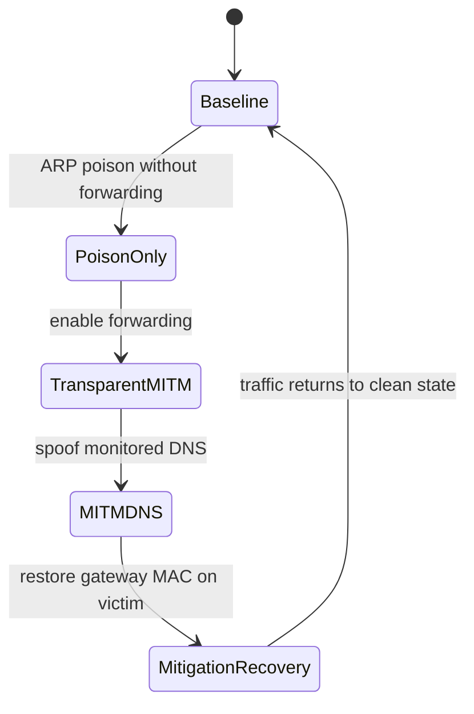

# Scenario Definitions

This page defines the exact timing and intent of the scenarios used in the lab.

## Scenario-State Diagram

## Main Evaluation Scenarios

| Scenario | Duration | Attack window | Purpose |
| --- | --- | --- | --- |
| `baseline` | 90 s | none | negative class and false-positive check |
| `arp-poison-no-forward` | 90 s | `t=10..70 s` | poisoning that breaks traffic but does not create a transparent path |
| `arp-mitm-forward` | 90 s | `t=10..70 s` | transparent MITM with forwarding enabled |
| `arp-mitm-dns` | 90 s | `t=10..70 s` | transparent MITM plus focused DNS spoofing |
| `dhcp-spoof` | 60 s | `t=10..50 s` | focused rogue DHCP advertisement verification on the lab LAN |
| `dhcp-starvation` | 60 s | `t=10..50 s` | spoofed-client DHCP starvation with gateway lease cleanup after the run |
| `mitigation-recovery` | 120 s | `t=10..45 s` attack, `t=45 s` mitigation | restoration and recovery timing |

### Main Timing Windows

- `baseline`
  - `t=0..90 s`: benign traffic only
- `arp-poison-no-forward`
  - `t=0..10 s`: clean prefix
  - `t=10..70 s`: ARP poisoning active, forwarding disabled
  - `t=70..90 s`: recovery tail
- `arp-mitm-forward`
  - `t=0..10 s`: clean prefix
  - `t=10..70 s`: ARP poisoning active, forwarding enabled
  - `t=70..90 s`: recovery tail
- `arp-mitm-dns`
  - `t=0..10 s`: clean prefix
  - `t=10..70 s`: ARP MITM + DNS spoof active
  - `t=70..90 s`: recovery tail
- `dhcp-spoof`
  - `t=0..10 s`: clean prefix
  - `t=10..50 s`: rogue DHCP offer/ACK broadcasts active
  - `t=50..60 s`: recovery tail
- `dhcp-starvation`
  - `t=0..10 s`: clean prefix
  - `t=10..50 s`: parallel spoofed DHCP clients request leases
  - `t=50..60 s`: gateway-side cleanup and recovery tail
- `mitigation-recovery`
  - `t=0..10 s`: clean prefix
  - `t=10..45 s`: ARP MITM + DNS spoof active
  - `t=45 s`: victim mitigation is applied
  - `t=45..120 s`: post-mitigation observation window

## Supplementary Scenarios

| Scenario | Duration | Purpose |
| --- | --- | --- |
| `dhcp-starvation-rogue-dhcp` | 90 s per worker level | DHCP starvation with increasing parallel spoofing workers, real lease-pool logging, and optional reactive rogue-DHCP takeover probes |
| `visibility-arp-mitm-dns` | 90 s | ARP MITM + DNS spoofing while all sensors receive a sampled live packet feed |
| `visibility-dhcp-spoof` | 60 s | rogue DHCP spoofing while all sensors receive a sampled live packet feed |

### Supplementary Timing Windows

- `dhcp-starvation-rogue-dhcp`
  - `t=0..10 s`: clean prefix
  - `t=10..80 s`: DHCP starvation using spoofed clients
  - with takeover enabled, `t=10..90 s`: reactive rogue DHCP replies run during the attack window
  - with takeover enabled, `t=15..90 s`: victim DHCP renew probes retry until takeover or window end
  - `t=90 s`: cleanup and recovery tail
- `visibility-arp-mitm-dns`
  - same attack pattern as the focused DNS spoof scenario
  - visibility campaigns retain one full switch pcap per scenario by default and keep compact wire-truth summaries for the rest
  - Detector, Zeek, and Suricata listen on the sampled live sensor interface
- `visibility-dhcp-spoof`
  - same attack pattern as the rogue DHCP spoofing scenario
  - visibility campaigns retain one full switch pcap per scenario by default and keep compact wire-truth summaries for the rest
  - Detector, Zeek, and Suricata listen on the sampled live sensor interface

## Canonical Commands

- demo path:
  - `make demo-ui`
- main plan:
  - `make experiment-plan`
- visibility plan:
  - `make visibility-plan`
- DHCP starvation worker-scaling plan:
  - `make starvation-takeover-plan`
- supplementary plan:
  - `make experiment-plan-extra`
- focused single-scenario wrappers:
  - `make scenario-arp-poison-no-forward`
  - `make scenario-arp-mitm-forward`
  - `make scenario-arp-mitm-dns`
  - `make scenario-dhcp-spoof`
  - `make scenario-dhcp-starvation`
  - `make scenario-dhcp-starvation-rogue-dhcp`
  - `make scenario-mitigation-recovery`
