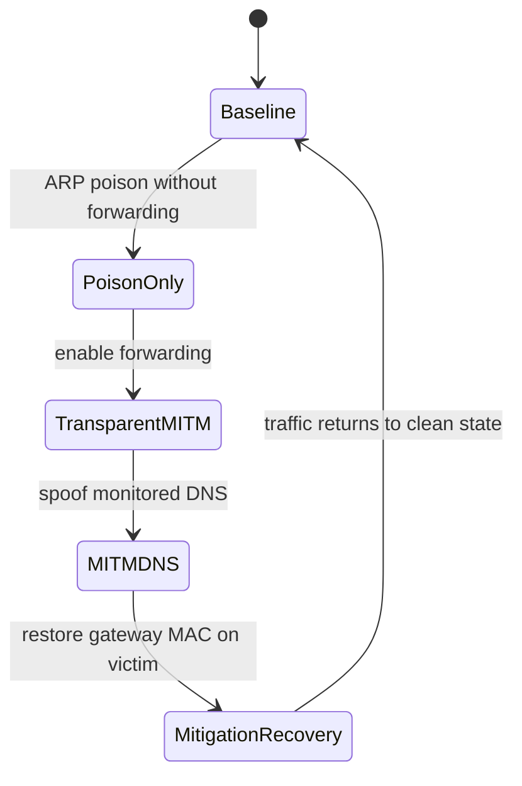

# Scenario Definitions

This page defines the exact timing and intent of the scenarios used in the lab.

## Scenario-State Diagram

## Main Evaluation Scenarios

| Scenario | Duration | Attack window | Purpose |
| --- | --- | --- | --- |
| `baseline` | 90 s | none | negative class and false-positive check |
| `arp-poison-no-forward` | 90 s | `t=10..70 s` | poisoning that breaks traffic but does not create a transparent path |
| `arp-mitm-forward` | 90 s | `t=10..70 s` | transparent MITM with forwarding enabled |
| `arp-mitm-dns` | 90 s | `t=10..70 s` | transparent MITM plus focused DNS spoofing |
| `mitigation-recovery` | 120 s | `t=10..45 s` attack, `t=45 s` mitigation | restoration and recovery timing |

### Main Timing Windows

- `baseline`
  - `t=0..90 s`: benign traffic only
- `arp-poison-no-forward`
  - `t=0..10 s`: clean prefix
  - `t=10..70 s`: ARP poisoning active, forwarding disabled
  - `t=70..90 s`: recovery tail
- `arp-mitm-forward`
  - `t=0..10 s`: clean prefix
  - `t=10..70 s`: ARP poisoning active, forwarding enabled
  - `t=70..90 s`: recovery tail
- `arp-mitm-dns`
  - `t=0..10 s`: clean prefix
  - `t=10..70 s`: ARP MITM + DNS spoof active
  - `t=70..90 s`: recovery tail
- `mitigation-recovery`
  - `t=0..10 s`: clean prefix
  - `t=10..45 s`: ARP MITM + DNS spoof active
  - `t=45 s`: victim mitigation is applied
  - `t=45..120 s`: post-mitigation observation window

## Supplementary Scenarios

| Scenario | Duration | Purpose |
| --- | --- | --- |
| `intermittent-arp-mitm-dns` | 90 s | pulse attack windows to test reaction speed and missed short windows |
| `noisy-benign-baseline` | 90 s | benign LAN churn to test false positives |
| `reduced-observability` | 90 s | detector sampling reduction to test degraded visibility |

### Supplementary Timing Windows

- `intermittent-arp-mitm-dns`
  - `t=0..10 s`: clean prefix
  - `t=10..15 s`: attack on
  - `t=15..25 s`: attack off
  - `t=25..30 s`: attack on
  - `t=30..40 s`: attack off
  - `t=40..45 s`: attack on
  - `t=45..55 s`: attack off
  - `t=55..60 s`: attack on
  - `t=60..90 s`: clean tail
- `noisy-benign-baseline`
  - benign DNS refreshes, neighbor cache churn, and extra background traffic
  - no attacker-controlled poisoning or spoofing
- `reduced-observability`
  - same attack pattern as the focused DNS spoof scenario
  - detector packet sampling is reduced through `MITM_LAB_PACKET_SAMPLE_RATE`

## Canonical Commands

- demo path:
  - `make demo-start`
  - `make demo-scenario`
  - `make demo-report`
  - `make demo-capture HOST=victim IFACE=vnic0`
- main plan:
  - `make experiment-plan`
- supplementary plan:
  - `make experiment-plan-extra`
- focused single-scenario wrappers:
  - `make scenario-arp-poison-no-forward`
  - `make scenario-arp-mitm-forward`
  - `make scenario-arp-mitm-dns`
  - `make scenario-mitigation-recovery`
