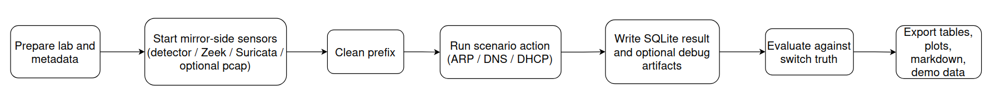

# Scenario Definitions

This page defines the exact timing and intent of the scenarios used in the lab.

## Scenario-State Diagram

## Reference Scenario

| Scenario | Duration | Attack window | Purpose |
| --- | --- | --- | --- |
| `baseline` | 30 s | none | separate negative-control and clean-sensor check |

Run it with `make baseline`; it is not part of the default `make experiment-plan` matrix.

## Main Evaluation Scenarios

| Scenario | Duration | Attack window | Purpose |
| --- | --- | --- | --- |
| `arp-poison-no-forward` | 30 s | `t=5..25 s` | poisoning that breaks traffic but does not create a transparent path |
| `arp-mitm-forward` | 30 s | `t=5..25 s` | transparent MITM with forwarding enabled |
| `arp-mitm-dns` | 45 s | `t=5..35 s` | transparent MITM plus focused DNS spoofing |
| `dhcp-spoof` | 30 s | `t=5..25 s` | focused DHCP spoofing verification on the lab LAN |

### Main Timing Windows

- `arp-poison-no-forward`
  - `t=0..5 s`: clean prefix
  - `t=5..25 s`: ARP poisoning active, forwarding disabled
  - `t=25..30 s`: clean tail
- `arp-mitm-forward`
  - `t=0..5 s`: clean prefix
  - `t=5..25 s`: ARP poisoning active, forwarding enabled
  - `t=25..30 s`: clean tail
- `arp-mitm-dns`
  - `t=0..5 s`: clean prefix
  - `t=5..35 s`: ARP MITM + DNS spoof active
  - `t=35..45 s`: clean tail
- `dhcp-spoof`
  - `t=0..5 s`: clean prefix
  - `t=5..25 s`: DHCP-spoof offer/ACK broadcasts active
  - `t=25..30 s`: clean tail

## Reliability Scenarios

| Scenario | Duration | Purpose |
| --- | --- | --- |
| `reliability-arp-mitm-dns` | 30 s | ARP MITM + DNS spoofing while all sensors receive the mirrored feed through NetEm |
| `reliability-dhcp-spoof` | 20 s | DHCP spoofing while all sensors receive the mirrored feed through NetEm |

### Reliability Timing Windows

- `reliability-arp-mitm-dns`
  - same attack pattern as the focused DNS spoof scenario
  - reliability campaigns use compact OVS snooping ground truth by default; pcaps are opt-in
  - Detector, Zeek, and Suricata listen on the NetEm-impaired sensor interface
- `reliability-dhcp-spoof`
  - same attack pattern as the DHCP-spoofing scenario
  - reliability campaigns use compact OVS snooping ground truth by default; pcaps are opt-in
  - Detector, Zeek, and Suricata listen on the NetEm-impaired sensor interface

## Canonical Commands

- demo path:
  - `make demo-ui`
- main plan:
  - `make experiment-plan`
- reliability plan:
  - `make reliability RUNS=3`
  - `make reliability-arp-dns RUNS=3`
  - `make reliability-dhcp RUNS=3 LOSS_LEVELS="70 80 90 100"`
- focused single-scenario wrappers:
  - `make scenario-arp-poison-no-forward`
  - `make scenario-arp-mitm-forward`
  - `make scenario-arp-mitm-dns`
  - `make scenario-dhcp-spoof`
  - `make scenario-reliability-arp-mitm-dns`
  - `make scenario-reliability-dhcp-spoof`
