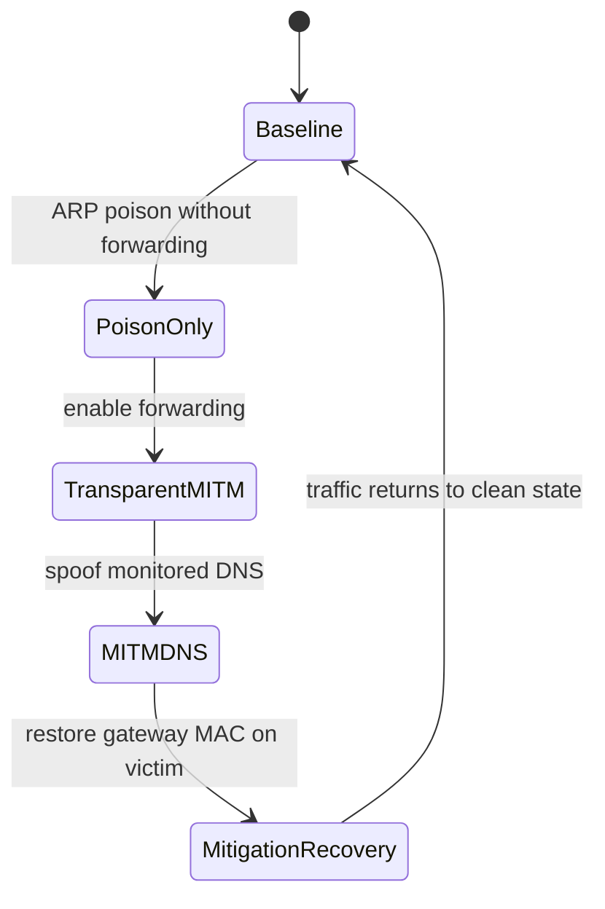

# Scenario Definitions

This page defines the exact timing and intent of the scenarios used in the lab.

## Scenario-State Diagram

## Reference Scenario

| Scenario | Duration | Attack window | Purpose |
| --- | --- | --- | --- |
| `baseline` | 30 s | none | separate negative-control and false-positive check |

Run it with `make baseline`; it is not part of the default `make experiment-plan` matrix.

## Main Evaluation Scenarios

| Scenario | Duration | Attack window | Purpose |
| --- | --- | --- | --- |
| `arp-poison-no-forward` | 45 s | `t=5..35 s` | poisoning that breaks traffic but does not create a transparent path |
| `arp-mitm-forward` | 45 s | `t=5..35 s` | transparent MITM with forwarding enabled |
| `arp-mitm-dns` | 45 s | `t=5..35 s` | transparent MITM plus focused DNS spoofing |
| `dhcp-spoof` | 30 s | `t=5..25 s` | focused rogue DHCP advertisement verification on the lab LAN |

### Main Timing Windows

- `arp-poison-no-forward`
  - `t=0..5 s`: clean prefix
  - `t=5..35 s`: ARP poisoning active, forwarding disabled
  - `t=35..45 s`: recovery tail
- `arp-mitm-forward`
  - `t=0..5 s`: clean prefix
  - `t=5..35 s`: ARP poisoning active, forwarding enabled
  - `t=35..45 s`: recovery tail
- `arp-mitm-dns`
  - `t=0..5 s`: clean prefix
  - `t=5..35 s`: ARP MITM + DNS spoof active
  - `t=35..45 s`: recovery tail
- `dhcp-spoof`
  - `t=0..5 s`: clean prefix
  - `t=5..25 s`: rogue DHCP offer/ACK broadcasts active
  - `t=25..30 s`: recovery tail

Mitigation is intentionally outside the default main plan because it is lower priority than detection and reliability. It remains available as the standalone `mitigation-recovery` scenario, with a default 75-second window and victim restoration at `t=30 s`.

## Supplementary Scenarios

| Scenario | Duration | Purpose |
| --- | --- | --- |
| `reliability-arp-mitm-dns` | 30 s | ARP MITM + DNS spoofing while all sensors receive the mirrored feed through NetEm |
| `reliability-dhcp-spoof` | 20 s | rogue DHCP spoofing while all sensors receive the mirrored feed through NetEm |
| `overload-arp-mitm-dns` | 20 s | ARP MITM + DNS spoofing while controlled ICMP background traffic tests detector packet-analysis throughput |
| `overload-dhcp-spoof` | 20 s | rogue DHCP spoofing while controlled ICMP background traffic tests detector packet-analysis throughput |

### Supplementary Timing Windows

- `reliability-arp-mitm-dns`
  - same attack pattern as the focused DNS spoof scenario
  - reliability campaigns use compact OVS snooping ground truth by default; pcaps are opt-in
  - Detector, Zeek, and Suricata listen on the NetEm-impaired sensor interface
- `reliability-dhcp-spoof`
  - same attack pattern as the rogue DHCP spoofing scenario
  - reliability campaigns use compact OVS snooping ground truth by default; pcaps are opt-in
  - Detector, Zeek, and Suricata listen on the NetEm-impaired sensor interface

## Canonical Commands

- demo path:
  - `make demo-ui`
- main plan:
  - `make experiment-plan`
- reliability plan:
  - `make reliability RUNS=3`
  - `make reliability-plan` for custom NetEm campaigns
- overload calibration plan:
  - `make overload-plan`
  - `make overload-summary`
- supplementary plan:
  - `make experiment-plan-extra`
- focused single-scenario wrappers:
  - `make scenario-arp-poison-no-forward`
  - `make scenario-arp-mitm-forward`
  - `make scenario-arp-mitm-dns`
  - `make scenario-dhcp-spoof`
  - `make scenario-reliability-arp-mitm-dns`
  - `make scenario-reliability-dhcp-spoof`
  - `make scenario-mitigation-recovery`
