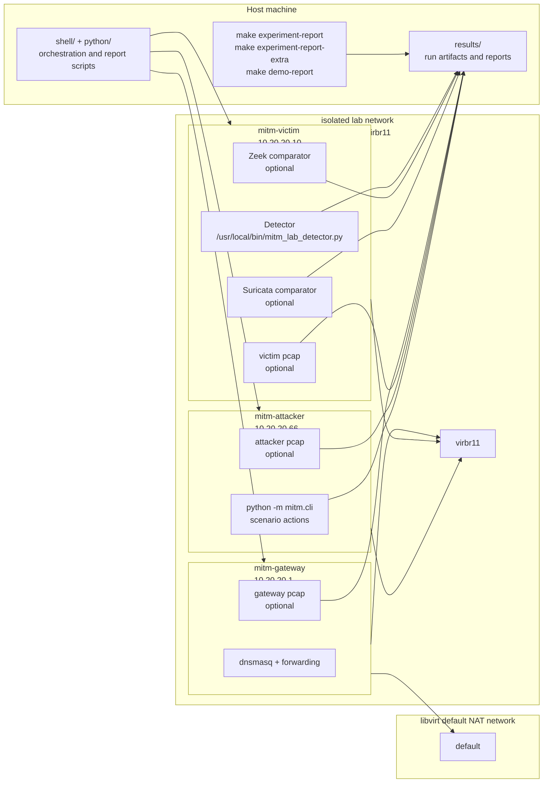

# Topology

This page documents the lab architecture used by the automated experiments.

## Architecture Diagram

## What Lives Where

- Host machine:
  - provisions and starts the VMs
  - orchestrates scenario runs
  - collects artifacts into `results/`
  - builds the main and supplementary reports
- `mitm-gateway`:
  - provides the lab gateway and DNS service
  - can produce gateway-side pcap when `PCAP_ENABLE=1`
- `mitm-victim`:
  - runs the main detector
  - optionally runs Zeek and Suricata
  - is the main observation point for detector logs and comparator logs
- `mitm-attacker`:
  - runs the automated attack-side scenario commands
  - can produce attacker-side pcap when `PCAP_ENABLE=1`

## Artifact Placement

- detector logs and detector explanation:
  - `results/<run>/victim/`
- Zeek comparator artifacts:
  - `results/<run>/zeek/`
- Suricata comparator artifacts:
  - `results/<run>/suricata/`
- optional pcap artifacts:
  - `results/<run>/pcap/`
- generated reports:
  - `results/experiment-report/`
  - `results/experiment-report-extra/`
  - `results/demo-report/`
