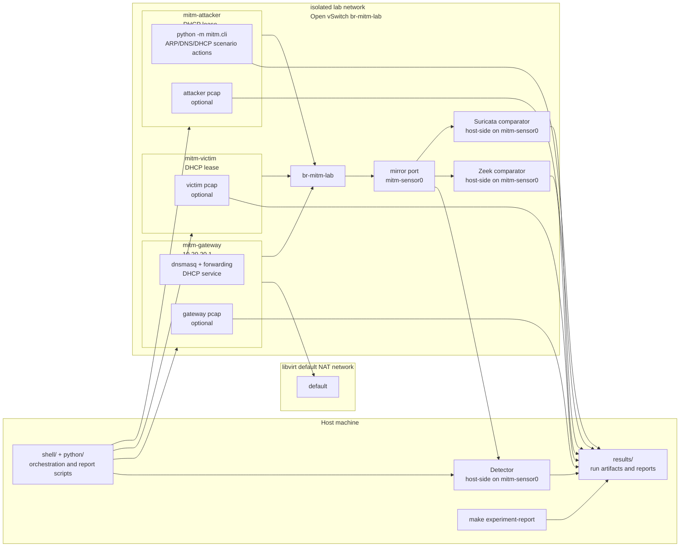

# Topology

This page documents the lab architecture used by the automated experiments.

## Architecture Diagram

## What Lives Where

- Host machine:
  - provisions and starts the VMs
  - owns the Open vSwitch fabric and mirror port
  - runs the main detector on `mitm-sensor0`
  - runs Zeek and Suricata comparators on `mitm-sensor0` when enabled
  - captures `pcap/sensor.pcap` as the preferred wire-truth source when `PCAP_ENABLE=1`
  - orchestrates scenario runs
  - collects artifacts into `results/`
  - builds the main and supplementary reports
- `mitm-gateway`:
  - provides the lab gateway, DNS service, and DHCP pool
  - is treated as the trusted DHCP server on the switch-facing LAN
  - can produce gateway-side pcap when `PCAP_ENABLE=1`
- `mitm-victim`:
  - receives its lab address over DHCP from the gateway
- `mitm-attacker`:
  - runs the automated attack-side scenario commands
  - discovers the victim host from the lab LAN during the normal automated attack path
  - receives its lab address over DHCP from the gateway
  - can produce attacker-side pcap when `PCAP_ENABLE=1`

## Artifact Placement

- detector logs and detector explanation:
  - `results/<run>/detector/`
- Zeek comparator artifacts:
  - `results/<run>/zeek/host/`
- Suricata comparator artifacts:
  - `results/<run>/suricata/host/`
- optional pcap artifacts:
  - `results/<run>/pcap/`
- generated reports:
  - `results/experiment-report/`
